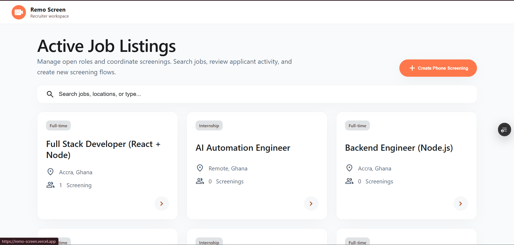
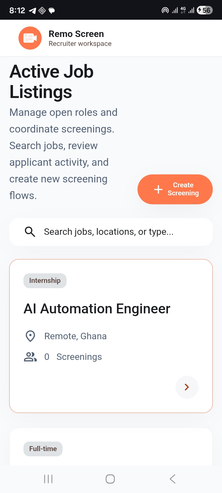
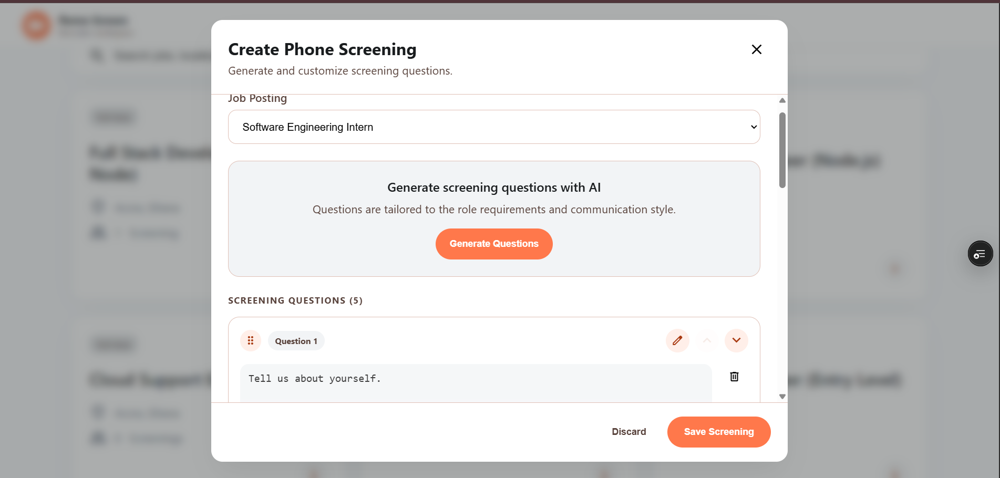
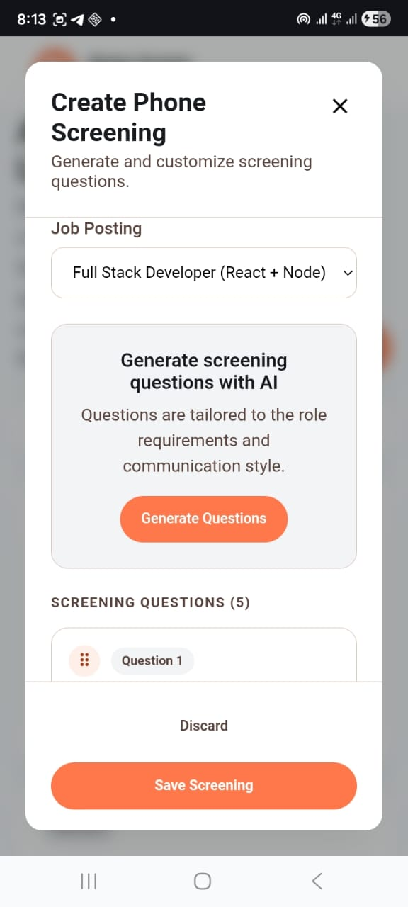

# RemoScreen

<p align='center'>
     
</p>
<p align='center'>A full‑stack–simulated phone screening tool for recruiters and candidates – built for the Remotown GmbH take‑home assessment.</p>

<div align="center">

[](https://nextjs.org/)
[](https://www.typescriptlang.org/)
[](https://vercel.com)

</div>

**Live Demo**: [https://remo-screen.vercel.app](https://remo-screen.vercel.app)

---

## Table of Contents

- [Overview](#overview)
- [Screenshots](#screenshots)
- [Features](#features)
- [Tech Stack](#tech-stack)
- [Live Demo](#live-demo)
- [Architecture](#architecture)
- [Getting Started](#getting-started)
- [Project Structure](#project-structure)
- [What I Built](#what-i-built)
- [Trade‑offs Made](#trade-offs-made)
- [Time Spent](#time-spent)
- [Design System](#design-system)
- [AI Tools Used](#ai-tools-used)

---

## Overview

**RemoScreen** is a two‑sided web application that helps recruiters build structured phone screening flows and lets candidates answer them one question at a time – all without a backend.

- **Recruiters** can create screenings, manage jobs, review applicants, and get AI‑styled analysis.
- **Candidates** use a public link, provide their details, and answer text (or placeholder audio) questions.

The assessment required **no backend** – all data lives in `localStorage` and seeded job data. This repo fulfills all “Must have” requirements and several “Nice to have” / “Bonus” items.

---

## Screenshots

| Page                     | Desktop                                                                                                 | Mobile                                                                                                   |
| ------------------------ | ------------------------------------------------------------------------------------------------------- | -------------------------------------------------------------------------------------------------------- |
| Jobs Listing             |                                     |                                     |
| Create Screening Modal   |         |         |
| Job Detail (Applicants)  |                           |                           |
| Applicant Responses + AI |  |  |
| Candidate Welcome        |               |               |
| Candidate Question Step  |       |       |
| Completion Screen        |             |             |

---

## Features

### 👩‍💼 Recruiter Side

- **Jobs page** – grid of job cards with title, location, employment type, and applicant count.
- **Create Screening** – modal with AI‑style question generation (mocked), editable questions, response‑type toggles (text/audio), custom questions, and save to `localStorage`.
- **Job detail page** – job metadata, copyable candidate link, list of applicants with pagination & search.
- **Applicant detail page** – full answers (text + audio placeholders), mocked “AI Insights” panel with loading simulation.
- **Toast notifications** – success/error/info feedback (e.g., “Screening created”).

### 🧑‍💼 Candidate Side

- **Welcome step** – collects name & email, shows job title and estimated duration.
- **One‑question‑at‑a‑time flow** – progress bar, next/previous navigation.
- **Mixed question types** – textarea for text questions, disabled recording UI + fallback textarea for audio placeholders.
- **Completion screen** – thank‑you message, estimated review time, confirmation note.
- **Duplicate submission prevention** – same email cannot submit twice for the same job.

### 🎨 UI / UX

- Fully responsive (mobile, tablet, desktop).
- Material Symbols icons throughout.
- Infinite scroll on jobs page + back‑to‑top button.
- Drag‑and‑drop reordering of questions in the creation modal (bonus).
- Loading skeletons and simulated async operations for better UX.

---

## Tech Stack

| Area             | Technology                          |
| ---------------- | ----------------------------------- |
| Framework        | Next.js 16 (App Router)             |
| Language         | TypeScript 5                        |
| Styling          | CSS Modules + CSS variables         |
| State Management | React hooks + Context (Toast)       |
| Persistence      | `localStorage` (mock “database”)    |
| Icons            | Material Symbols (Google Fonts)     |
| Drag & Drop      | `@dnd-kit` (for sortable questions) |
| Deployment       | Vercel (recommended)                |

---

## Live Demo

🔗 **Deployed at**: [https://remo-screen.vercel.app](https://remo-screen.vercel.app)

> [!NOTE]
> Because this app uses `localStorage`, the data is unique to your browser. Feel free to create screenings and submit as a candidate – everything persists across page reloads.

---

## Architecture

```mermaid
flowchart TD
  subgraph App["Next.js App Router"]
    Home["/"]
    JobsList["/jobs"]
    JobDetail["/jobs/[jobId]"]
    ApplicantDetail["/jobs/[jobId]/applicants/[applicantId]"]
    Screening["/screening/[jobId]"]
    NotFound["Custom 404"]
  end

  subgraph UI["Shared UI + Layout"]
    Layout["src/app/layout.tsx"]
    Bootstrap["AppBootstrap"]
    Header["Header"]
    Modal["Modal"]
    Toast["Toast + ToastContext"]
    Skeleton["Skeletons / loading states"]
    NotFoundState["Branded empty + missing states"]
    Icon["Material Symbols Icon"]
    ScreeningShell["ScreeningShell"]
    AudioPlayer["AudioPlayer"]
  end

  subgraph Recruiter["Recruiter Flow"]
    JobsPage["Jobs page"]
    CreateScreeningModal["CreateScreeningModal"]
    JobPipeline["Applicant pipeline + in-progress list"]
    ApplicantReview["Applicant detail + mocked analysis"]
  end

  subgraph Candidate["Candidate Flow"]
    WelcomeStep["Welcome step"]
    QuestionStep["Question step"]
    CompletionStep["Completion step"]
  end

  subgraph Data["Static Data + Browser Storage"]
    SeedJobs["src/data/jobs.ts"]
    QuestionBank["src/data/questions.ts"]
    Images["src/lib/images.ts"]
    JobsStore["aihrly_jobs"]
    ScreeningsStore["aihrly_screenings"]
    SubmissionsStore["aihrly_submissions"]
    DraftsStore["aihrly_candidate_sessions"]
    AnalysesStore["aihrly_analyses"]
  end

  Home --> JobsList
  Layout --> Bootstrap
  Layout --> Header
  JobsList --> JobsPage
  JobDetail --> CreateScreeningModal
  JobDetail --> JobPipeline
  JobDetail --> ApplicantReview
  Screening --> ScreeningShell
  ScreeningShell --> WelcomeStep
  ScreeningShell --> QuestionStep
  ScreeningShell --> CompletionStep
  ApplicantReview --> AudioPlayer

  JobsPage --> SeedJobs
  CreateScreeningModal --> QuestionBank
  Screening --> Images

  JobsPage --> JobsStore
  CreateScreeningModal --> ScreeningsStore
  JobDetail --> ScreeningsStore
  JobDetail --> SubmissionsStore
  JobDetail --> DraftsStore
  Screening --> DraftsStore
  Screening --> SubmissionsStore
  ApplicantReview --> SubmissionsStore
  ApplicantReview --> AnalysesStore

  Toast --> ToastContext["ToastContext"]
  ToastContext --> Toast
  Modal --> Icon
  ScreeningShell --> Icon
  NotFoundState --> Icon
  Skeleton --> Icon
```



**Key decisions**:

- No backend or API layer was added, so recruiter and candidate state stays in the browser.
- `localStorage` is split by concern, which keeps the code easier to reason about even though it is still browser-only.
- `ToastContext` is the only global React context; most other state stays local to each route or component.
- CSS Modules and `@dnd-kit` stay in place for scoped styling and accessible sorting.

---

## Getting Started

### Prerequisites

- Node.js 18+ or 20+
- npm / yarn / pnpm

### Installation

```bash
git clone https://github.com/Programming-Sai/remo-screen.git
cd remo-screen
npm install
```

### Run Development Server

```bash
npm run dev
# or
yarn dev
```

Open [http://localhost:3000](http://localhost:3000) to see the app.

### Build for Production

```bash
npm run build
npm start
```

---

## Project Structure

```

./remo-screen/*
        ├─ public/*
        |       ├─ file.svg
        |       ├─ globe.svg
        |       ├─ logo.png
        |       ├─ next.svg
        |       ├─ remo.png
        |       ├─ vercel.svg
        |       └─ window.svg
        ├─ src/*
        |       ├─ app/*
        |       |       ├─ jobs/*
        |       |       |       ├─ [jobId]/*
        |       |       |       |       ├─ applicants/*
        |       |       |       |       |       └─ [applicantId]/*
        |       |       |       |       |               ├─ loading.tsx
        |       |       |       |       |               ├─ page.module.css
        |       |       |       |       |               └─ page.tsx
        |       |       |       |       ├─ loading.tsx
        |       |       |       |       ├─ page.module.css
        |       |       |       |       └─ page.tsx
        |       |       |       ├─ loading.tsx
        |       |       |       ├─ page.module.css
        |       |       |       └─ page.tsx
        |       |       ├─ screening/*
        |       |       |       └─ [jobId]/*
        |       |       |               ├─ loading.tsx
        |       |       |               ├─ page.module.css
        |       |       |               └─ page.tsx
        |       |       ├─ favicon.ico
        |       |       ├─ globals.css
        |       |       ├─ layout.tsx
        |       |       ├─ not-found.module.css
        |       |       ├─ not-found.tsx
        |       |       ├─ page.module.css
        |       |       └─ page.tsx
        |       ├─ components/*
        |       |       ├─ candidate/*
        |       |       |       ├─ ScreeningCompletionStep/*
        |       |       |       |       └─ ScreeningCompletionStep.tsx
        |       |       |       ├─ ScreeningQuestionStep/*
        |       |       |       |       └─ ScreeningQuestionStep.tsx
        |       |       |       ├─ ScreeningShell/*
        |       |       |       |       └─ ScreeningShell.tsx
        |       |       |       └─ ScreeningWelcomeStep/*
        |       |       |               └─ ScreeningWelcomeStep.tsx
        |       |       ├─ recruiter/*
        |       |       |       ├─ AudioPlayer/*
        |       |       |       |       ├─ AudioPlayer.module.css
        |       |       |       |       └─ AudioPlayer.tsx
        |       |       |       └─ CreateScreeningModal/*
        |       |       |               ├─ CreateScreeningModal.module.css
        |       |       |               └─ CreateScreeningModal.tsx
        |       |       ├─ ui/*
        |       |       |       ├─ Header/*
        |       |       |       |       ├─ Header.module.css
        |       |       |       |       └─ Header.tsx
        |       |       |       ├─ Icon/*
        |       |       |       |       └─ Icon.tsx
        |       |       |       ├─ Modal/*
        |       |       |       |       ├─ Modal.module.css
        |       |       |       |       └─ Modal.tsx
        |       |       |       ├─ NotFoundState/*
        |       |       |       |       ├─ NotFoundState.module.css
        |       |       |       |       └─ NotFoundState.tsx
        |       |       |       ├─ Skeleton/*
        |       |       |       |       ├─ Skeleton.module.css
        |       |       |       |       └─ Skeleton.tsx
        |       |       |       └─ Toast/*
        |       |       |               ├─ Toast.module.css
        |       |       |               └─ Toast.tsx
        |       |       └─ AppBootstrap.tsx
        |       ├─ contexts/*
        |       |       └─ ToastContext.tsx
        |       ├─ data/*
        |       |       ├─ jobs.ts
        |       |       └─ questions.ts
        |       ├─ lib/*
        |       |       ├─ images.ts
        |       |       ├─ storage.ts
        |       |       └─ timeFormat.ts
        |       ├─ styles/*
        |       |       └─ tokens.css
        |       └─ types/*
        |               └─ index.ts
        ├─ .gitignore
        ├─ eslint.config.mjs
        ├─ next.config.ts
        ├─ package-lock.json
        ├─ package.json
        ├─ README.md
        └─ tsconfig.json

```

---

## What I Built

### Must‑have (all ✅ – as required by spec)

- [x] **Jobs page** – grid of job cards showing title, location, employment type, and number of phone screenings created.
- [x] Each job card is clickable → navigates to job detail page.
- [x] Primary “Create Phone Screening” button opens modal.
- [x] **Create Screening modal** – step 1: select a job from dropdown.
- [x] Step 2: “Generate Questions” button (with fake loading) produces 5–8 questions.
- [x] Each generated question is editable: question text, response‑type selector (text/audio), remove button.
- [x] “Add Custom Question” button appends a new empty question.
- [x] “Save Screening” persists the screening to `localStorage` and returns to job detail page.
- [x] **Job detail page** – job header (title, location, employment type, description).
- [x] Copy‑able public screening link for candidates.
- [x] List of **submitted** applicants (name, email, submission date, “View Responses”).
- [x] Empty state when no applicants.
- [x] Shows whether a screening exists for this job; prompts to create one if missing.
- [x] **Applicant detail page** – header with name, email, submission timestamp.
- [x] List of question–answer pairs (text answers rendered, audio answers show a mocked/disabled player).
- [x] “Analyze Response” button → renders mocked analysis panel (summary, strengths, concerns, recommendation) with simulated loading.
- [x] Back link to job detail page.
- [x] **Candidate screening page** – welcome step asks for name and email (both required).
- [x] Question flow: one question at a time, shows question number / total.
- [x] For text questions: textarea. For audio questions: placeholder block with disabled record button + fallback textarea (candidate uses text).
- [x] After answering, can advance to next question (back navigation allowed as a plus).
- [x] Final step: thank‑you screen. Full submission saved to `localStorage` under `aihrly_submissions` key.
- [x] Progress indicator (progress bar + X of Y counter).

### Nice‑to‑have / Bonus (selected – from spec section 7)

- [x] Search/filter by job title (jobs page)
- [x] Drag‑and‑drop reordering of questions in create‑screening flow
- [x] “X applicants screened” badge on each job card
- [x] Infinite scroll + back‑to‑top button (jobs page)
- [x] Pagination + search for submitted applicants (job detail)
- [x] Toast notification system
- [x] Responsive design (mobile, tablet, desktop)
- [x] Relative timestamps (“applied 2 days ago”)
- [x] Random hero images on candidate welcome screen
- [x] Mock audio player with play/pause & seek (UI placeholder – no real recording)
- [x] Lightweight CSS transitions (loading states, hover effects)

### Not attempted (due to time / scope)

- [ ] Real audio recording (MediaRecorder API) – spec says placeholder only.
- [ ] Dark/light mode toggle – bonus, not implemented.
- [ ] Unit tests (Jest / RTL) – skipped to prioritise end‑to‑end functionality.
- [ ] Framer Motion animations – skipped.

---

## Trade‑offs Made

- **CSS Modules over Tailwind** – I chose CSS Modules because the provided design references used a custom design system. It gave me fine‑grained control without fighting a utility framework.

---

## Design System

The UI draws inspiration from **Google Meet** and **Google Forms** – calm, spacious, form‑centric layouts with restrained color and soft elevation.

- **Primary accent color** – `#ff784b` (extracted directly from Remotwon's own landing page).
- Only one primary color – a deliberate choice to keep the interface minimal and focused, avoiding dashboard noise.
- Material Symbols for icons (same as Google uses).
- CSS Modules with semantic variables for maintainable theming.

---

## Time Spent

**Approximately 18–20 hours** broken down as:

---

## AI Tools Used

During development I used the following AI assistants:

- **ChatGPT** – ideation, boilerplate generation, error debugging.
- **DeepSeek** – code refactoring and component architecture.
- **GitHub Copilot** – real‑time autocompletion and test data generation.
- **OpenAI Codex** – quick prototyping of utility functions.
- **Google Stitch** – design system alignment and CSS variable suggestions.

Every line of generated code was reviewed, understood, and adapted to fit the project. I can explain any part during the follow‑up interview.

---
